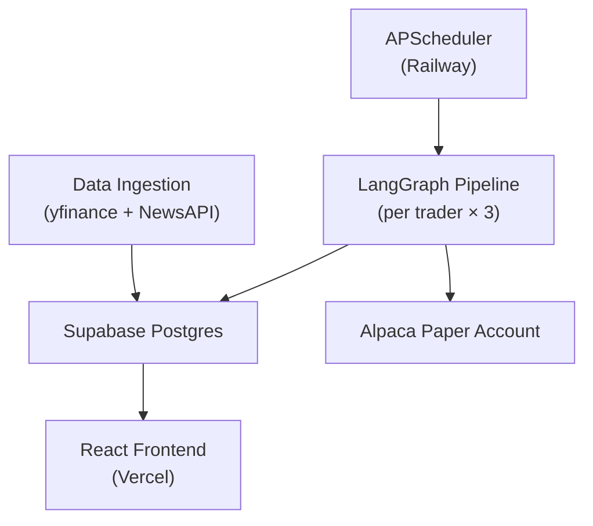
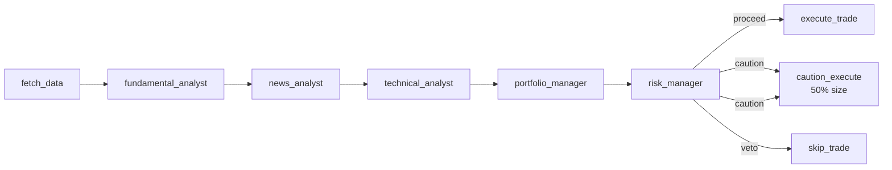

# Meridian Capital
### AI Hedge Fund Simulation

**Live:** [hedge-fund-sim.vercel.app](https://hedge-fund-sim.vercel.app) &nbsp;|&nbsp;
**API:** [hedge-fund-sim-production.up.railway.app](https://hedge-fund-sim-production.up.railway.app) &nbsp;|&nbsp;
**Docs:** [/docs](https://hedge-fund-sim-production.up.railway.app/docs) &nbsp;|&nbsp;
**Repo:** [github.com/jeffdylansmith/hedge-fund-sim](https://github.com/jeffdylansmith/hedge-fund-sim)

Three AI traders with distinct investment personalities analyze real market 
data and execute paper trades autonomously throughout the trading day. 
Built to explore multi-agent orchestration, LLM reliability patterns, 
and the engineering challenges of production AI systems.

---

## When To Watch

| Time (ET) | Event |
|---|---|
| 8:30 AM | Market session begins — hourly pipeline starts |
| 9:00 AM | Discovery agent screens for new opportunities |
| 9:30 AM | Fundamental analysis batch runs |
| 8:30 AM – 4:00 PM | Full agent pipeline runs every hour |
| 3:45 PM | All positions flattened — P&L realized |
| 4:05 PM | Each trader posts an EOD journal entry |
| Every 30 min | DB reconciled against Alpaca paper account |

---

## System Architecture



---

## The Three Traders

| Trader | Strategy | Risk | Personality |
|---|---|---|---|
| **Alex** | Aggressive momentum | High | Buys breakouts, chases RSI strength, hates sitting in cash |
| **Jordan** | Conservative macro | Low | Waits for conviction, prefers cash over mediocre trades |
| **Casey** | Contrarian | Medium | Fades crowded trades — strong bullish news is a sell signal |

Each trader runs the same LangGraph graph parameterized by a `TraderConfig` 
object. Personality strings inject into the portfolio manager system prompt. 
Adding a fourth trader is one dataclass instance.

---

## Agent Pipeline



Both execute nodes call `generate_trader_reactions()` internally after execution, generating in-character responses from the other two traders and writing them to the feed.

- **fetch_data** — only DB read node; loads prices, news, positions, 
  fund balance, fundamental scores, and trader memory into 
  `HedgeFundState`. All downstream nodes read from typed state.

- **fundamental_analyst** — reads pre-scored fundamentals from the 
  daily batch. Injects top/bottom 5 tickers by score into news context. 
  No LLM call in the pipeline node — scores and verdicts are 
  pre-computed by the 9:30 AM batch job which calls Claude Haiku. 
  The pipeline node reads pre-scored data from state and injects context.

- **news_analyst** — sends recent headlines for all watchlist tickers 
  to Claude Haiku. Returns `{summary, sentiment}` with trader persona 
  injected. Two-attempt JSON parsing, neutral fallback on failure.

- **technical_analyst** — computes RSI(14), MACD, SMA10/20 in pandas. 
  Filters tickers with fewer than 14 candles before the LLM call. 
  Sends pre-computed indicators to Claude Haiku for synthesis.

- **portfolio_manager** — processes watchlist in batches of 10 to avoid 
  token truncation. Each batch receives prior decisions as context to 
  prevent concentration drift. Supports three LLM backends: 
  Claude Haiku (production), Groq/Llama 3.1 8B, local ollama.

- **risk_manager** — computes concentration in Python, sends trade 
  proposal to Claude Haiku. Routes graph on `recommendation`:
  proceed → full size, caution → 50% size, veto → skip entirely.

- **cross-talk** — after each BUY/SELL, generates in-character reactions 
  from the other two traders referencing the actual trade and their 
  recent decisions. Feeds the drama in the home feed.

---

## Data Layer

| Source | Used for |
|---|---|
| yfinance | OHLCV prices (hourly), fundamentals, opportunity screener |
| NewsAPI | Market headlines — dynamically resolved for all watchlist tickers |
| Alpaca | Paper trade execution, position ground truth |
| Supabase | All persistence — prices, decisions, positions, NAV history |

---

## Key Engineering Decisions

**LangGraph over CrewAI** — Migrated mid-project when the portfolio 
manager ignored JSON formatting instructions and the risk circuit-breaker 
needed conditional routing CrewAI's sequential process couldn't express. 
LangGraph gives typed state, explicit conditional edges, and node-level 
testability.

**Structured output pattern** — Never trust LLM formatting. Every agent 
calls Claude, receives raw text, parses in application code, retries once 
with markdown fence stripping, falls back to a safe default on second 
failure. Validation logic lives in code, not in the model's output.

**Risk manager as real circuit breaker** — Three-path conditional routing: 
proceed, caution (halves position size), veto (skips execution entirely). 
The caution path creates a local reduced copy of the trade proposal 
with shares halved, then passes it directly to the shared execution 
logic — state['trade_proposal'] is never modified.

**Atomic DB operations via Postgres RPC** — Position flattening and 
reconciliation use Supabase RPC functions that run as single Postgres 
transactions. The REST client alone can't guarantee multi-table atomicity — 
a crash between an UPDATE and DELETE would leave the DB in a half-written 
state.

**Self-healing reconciliation** — Every 30 minutes, Alpaca positions are 
treated as ground truth. Discrepancies are auto-corrected and logged to 
`reconciliation_log`. Runs 24/7 regardless of market hours — data 
integrity is infrastructure, not a trading concern.

**RAG memory layer** — Traders receive a performance memory block in their 
system prompt: win rate and P&L from the last 30 days, behavioral patterns and 
decision distribution from the last 14 days. Pure Python computation from the trades table — no LLM call. 
Outcome-supervised behavioral adaptation without fine-tuning.

**LLM provider abstraction** — `LLM_PROVIDER` env var switches the 
portfolio manager between Claude Haiku (default), Groq-hosted Llama 3.1 8B 
(free tier), or a local ollama instance. One env var, no code change. 
Designed for future local inference on Apple Silicon via Tailscale.

---

## ML / AI Engineering

**Training data pipeline** — `GET /training/export` exports agent 
decisions paired with trade outcomes as JSONL instruction-tuning pairs. 
Each pair includes market context, technical signals, trader personality, 
and outcome label (profitable / unprofitable / open).

**LoRA fine-tuning** — `scripts/finetune.py` implements parameter-efficient 
fine-tuning of Llama 3.1 8B (r=16, α=32). The system accumulates labeled 
training pairs daily. Fine-tuning on trader-specific outcome data is the 
intended next step — the infrastructure is built, the run hasn't been 
executed yet.

**Why LoRA** — Full fine-tuning of a 7B model requires ~28GB VRAM. LoRA 
trains ~1% of parameters via low-rank decomposition, reducing memory to 
~6GB. Each trader could eventually carry their own adapter loaded on top 
of the shared base model.

---

## Stack

| Layer | Technology |
|---|---|
| Language | Python 3.11 |
| Agent orchestration | LangGraph |
| LLM (production) | Anthropic Claude Haiku |
| LLM (experimentation) | Groq / Llama 3.1 8B |
| LLM (local) | ollama (configurable) |
| API | FastAPI |
| Database | Supabase Postgres |
| Frontend | React + Vite + Recharts |
| Scheduling | APScheduler |
| Paper trading | Alpaca (alpaca-py, paper=True) |
| Backend hosting | Railway |
| Frontend hosting | Vercel |

---

## Running Locally

```bash
git clone https://github.com/jeffdylansmith/hedge-fund-sim
cd hedge-fund-sim
pip install -r requirements.txt

# Required — set in .env
ANTHROPIC_API_KEY=...
SUPABASE_URL=...
SUPABASE_KEY=...
NEWS_API_KEY=...
ALPACA_API_KEY=...
ALPACA_SECRET_KEY=...

# Required before running any script
export PYTHONPATH=/path/to/hedge-fund-sim

# Start API
uvicorn api.main:app --reload

# Start frontend
cd frontend && npm install && npm run dev
```

---

## What's Next

- Testing suite — unit tests for agent functions, integration tests 
  for the LangGraph pipeline, CI/CD gate on Railway deploys
- Execute first LoRA fine-tuning run on trader decision history
- Supabase RLS — enable before making repo fully public
- Local inference on Apple Silicon via ollama + Tailscale
- Portfolio value history accumulating — sparkline tells a richer 
  story over time