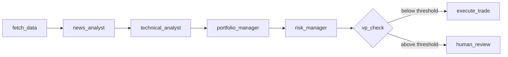
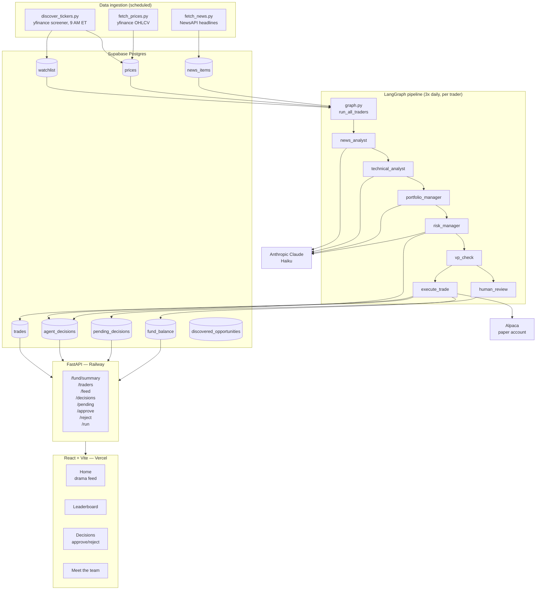

# Meridian Capital — AI Hedge Fund Simulation

A multi-agent AI system that simulates a hedge fund with three competing traders, each with a distinct investment personality, running on real market data. Agents analyze news sentiment, compute technical signals, assess risk, and propose trades — automatically, three times a day, against a live paper trading account.

**[Live Demo →](https://hedge-fund-sim.vercel.app)**

---

## What it does

Every trading session, the system:

1. Screens the market for the day's biggest movers and most-active names, bootstraps 30 days of price history on new tickers, and rotates stale ones out after 14 days
2. Runs a four-agent pipeline for each trader across every watched ticker — news sentiment, technical analysis, trade proposal, and risk assessment — each agent tuned to that trader's investment style
3. Routes all trades directly to execution; VP circuit breaker converts oversized positions to HOLD rather than blocking execution
4. Submits approved orders to an Alpaca paper trading account and logs every decision with full reasoning for audit

---

## Stack

| Layer | Technology |
|---|---|
| Language | Python 3.11 |
| Agent orchestration | LangGraph |
| LLM | Anthropic Claude Haiku (`claude-haiku-4-5-20251001`) |
| API | FastAPI |
| Database | Supabase Postgres |
| Frontend | React + Vite |
| Scheduling | APScheduler |
| Paper trading | Alpaca (`alpaca-py`, `paper=True`) |
| Market data | yfinance |
| News data | NewsAPI |
| Frontend hosting | Vercel |
| Backend hosting | Railway |

---

## Agent pipeline

Each trader runs an independent instance of the same four-node LangGraph graph. Agents receive data through typed state — no free-text communication between nodes.



### Nodes

**`news_analyst`** — calls Claude with the last 48 hours of headlines for a ticker. Returns `{summary, sentiment}`. Persona-aware: Alex's analyst weights momentum catalysts; Jordan's applies a skeptical macro lens; Casey's looks for crowded-trade reversals.

**`technical_analyst`** — computes RSI, MACD, and trend from price history in Python, then passes computed signals to Claude for interpretation. Returns `{trend, signals}`. Also persona-aware.

**`portfolio_manager`** — receives the full state (news summary, technical signals, current positions, available cash) and proposes a trade. Returns `{ticker, action, shares, reasoning, confidence}`. Two-attempt retry loop with markdown fence stripping on the second attempt.

**`risk_manager`** — computes position concentration in application code from live prices, injects it as a fact into the prompt, and asks Claude to assess risk. Returns `{risk_score, concentration_pct, flags, recommendation, rationale}`. The LLM interprets; the math happens in code.

**`vp_check`** — pure Python. If `trade_value > available_capital × vp_threshold`, routes to `human_review`. No LLM call.

**`execute_trade`** — writes to Supabase, submits to Alpaca, decrements fund balance. Pre-trade cash check blocks any BUY that would overdraw the account.

---

## The three traders

Each trader is a `TraderConfig` instance injected into the same graph. Adding a fourth trader is one dataclass instance and one database row.

| Trader | Style | Risk | VP threshold |
|---|---|---|---|
| Alex | Aggressive momentum | High | 50% of capital |
| Jordan | Conservative macro | Low | 30% of capital |
| Casey | Contrarian | Medium | 50% of capital |

Personality strings inject into the portfolio manager system prompt. Separate persona strings inject into each analyst's system prompt — so Alex's news analyst weights breakout catalysts while Casey's looks for overcrowded trades on the same raw data.

---

## System architecture



---

## Key architectural decisions

### LangGraph over CrewAI

Migrated mid-project after two problems: the portfolio manager was ignoring JSON output instructions (CrewAI agents communicated via free-text strings), and the VP circuit-breaker required conditional routing that CrewAI's sequential process couldn't express. LangGraph gives typed state, explicit conditional edges, and node-level testability. Each node is a plain function — swapping Claude for a different model is a one-line change.

### Structured output pattern

Agent functions never trust LLM output format. Every node calls Claude, receives raw text, parses and validates in application code, strips markdown fences on retry if parsing fails, and appends to `state["errors"]` on second failure. Validation logic lives in code, not in the prompt.

### Computation stays in code

Anything that can be computed deterministically is. RSI, MACD, and trend are computed in Python before being passed to the technical analyst. Position concentration percentage is computed from live prices before being injected into the risk manager prompt. The LLM interprets facts; it doesn't derive them.

### Supabase write pattern

Agent functions are pure — LLM call in, structured dict out. All database writes happen in node wrappers in `graph.py`. This separates side effects from reasoning logic and makes each piece independently testable.

### Per-trader parameterization

Alex, Jordan, and Casey are one graph instantiated three times with different `TraderConfig` objects. The config carries personality strings for the portfolio manager, persona strings for each analyst, risk tolerance, and VP threshold. The behavioral differences between traders emerge entirely from configuration — there is no branching logic in the graph itself.

### Discovery-gated pipeline

Rather than running the full agent pipeline against a fixed static watchlist, a daily screener (yfinance `day_gainers` + `most_actives`) surfaces net-new tickers, filters by market cap and volume, bootstraps 30 days of price history, and expires names after 14 days. This keeps the watchlist fresh without manual curation and bounds compute costs as the universe grows.

---

## Frontend

Four pages, polling every 30 seconds:

- **Home** — live agent decision feed, fund stat cards, trader standings, NAV sparkline
- **Leaderboard** — P&L ranking, mark-to-market portfolio values
- **Decisions** — full audit trail with agent reasoning, filterable by trader; approve or reject pending trades inline
- **Meet the team** — trader cards with personality description and most recent decision quote

---

## Local setup

**Prerequisites:** Python 3.11, Node 18+

```bash
git clone https://github.com/jeffdylansmith/hedge-fund-sim
cd hedge-fund-sim

# Python dependencies
python -m venv venv && source venv/bin/activate
pip install -r requirements.txt

# Environment variables
cp .env.example .env
# Fill in: SUPABASE_URL, SUPABASE_KEY, ANTHROPIC_API_KEY,
#           ALPACA_API_KEY, ALPACA_SECRET_KEY, NEWS_API_KEY

# Run the API
export PYTHONPATH=$(pwd)
uvicorn api.main:app --reload

# Frontend (separate terminal)
cd frontend
cp .env.example .env.local
# Set VITE_API_URL=http://localhost:8000
npm install && npm run dev
```

**Trigger a manual trading session:**
```bash
curl -X POST http://localhost:8000/run
```

---

## Project structure

```
hedge-fund-sim/
├── agents/
│   ├── graph.py               # LangGraph graph, nodes, HedgeFundState, run_all_traders()
│   ├── news_analyst.py        # News sentiment agent
│   ├── technical_analyst.py   # RSI, MACD, trend + LLM interpretation
│   ├── portfolio_manager.py   # Trade proposal with retry loop
│   ├── risk_manager.py        # Concentration scoring and risk assessment
│   └── trader_config.py       # TraderConfig dataclass — Alex, Jordan, Casey
├── ingestion/
│   ├── discover_tickers.py    # Daily screener — yfinance, filter, bootstrap, TTL
│   ├── fetch_prices.py        # yfinance → Supabase prices
│   └── fetch_news.py          # NewsAPI → Supabase news_items
├── api/
│   └── main.py                # FastAPI + APScheduler + all endpoints
├── frontend/
│   └── src/
│       └── pages/             # Home, Leaderboard, Decisions, Team
└── utils/
    └── db.py                  # Supabase client
```
